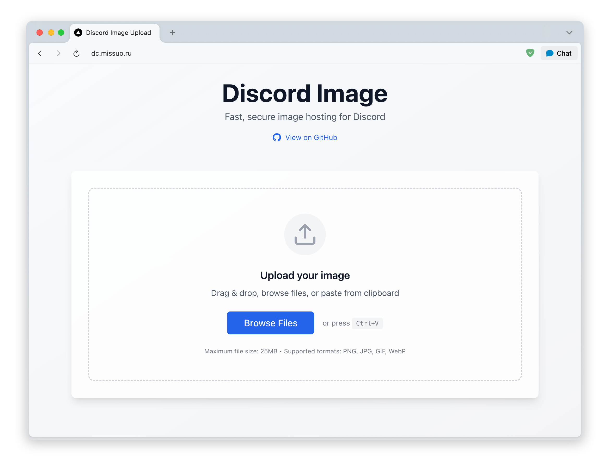

[![GitHub Workflow][1]](https://github.com/missuo/discord-image/actions)
[![Go Version][2]](https://github.com/missuo/discord-image/blob/main/go.mod)
[![Docker Pulls][3]](https://hub.docker.com/r/missuo/discord-image)

[1]: https://img.shields.io/github/actions/workflow/status/missuo/discord-image/release.yaml?logo=github
[2]: https://img.shields.io/github/go-mod/go-version/missuo/discord-image?logo=go
[3]: https://img.shields.io/docker/pulls/missuo/discord-image?logo=docker

Powerful image hosting / file sharing implemented using Discord Bot.

**Deployment requires applying for a Discord account and creating a bot to obtain a Bot Token. However, this article will not mention these steps. Please Google how to do it yourself.**

## Features
- Maximum supported single file size: 25MB.
- Files never expire.
- Support viewing upload history, support deleting file.
- Support for uploading images, videos, and other files.
- Support custom proxy url.
- Support automatic deletion of files after uploading to the server, will not occupy your server's hard disk.
- Support private deployment, secure and reliable.

## Preview

You can click here to test the demo I deployed: [https://dc.missuo.ru](https://dc.missuo.ru)

The configuration file used by the above demo sets the `proxy_url` and enables `auto_delete`. So you can access files normally in mainland China.



If you are interested in the implementation principle, you can read [https://missuo.me/posts/discord-file-sharing/](https://missuo.me/posts/discord-file-sharing/).

## Start with Docker

```bash
mkdir discord-image && cd discord-image
wget -O compose.yaml https://raw.githubusercontent.com/missuo/discord-image/main/compose.yaml
nano compose.yaml
docker compose up -d
```
### Nginx Reverse Proxy

```nginx
location / {
    proxy_pass http://localhost:8080;
    proxy_set_header Host $host;
    proxy_set_header X-Real-IP $remote_addr;
    proxy_set_header X-Forwarded-For $proxy_add_x_forwarded_for;
    proxy_set_header REMOTE-HOST $remote_addr;
    proxy_set_header Upgrade $http_upgrade;
    proxy_set_header Connection $connection_upgrade;
    proxy_http_version 1.1;
} 
```

## Config files and environment variables

You can leave `proxy_url` unset, but the domain of Discord cannot be accessed in mainland China. If you want to access Discord in mainland China, you must configure this option. How to deploy the proxy url, please continue to read below.

Please be careful not to modify the `bot_token` at will. If you modify the `bot_token`, the previous file links may become invalid.

```yaml
bot:
  token: "" # Discord bot token
  channel_id: "" # Channel ID

upload:
  temp_dir: "uploads" # Temporary directory for storing files

proxy_url: example.com # Custom proxy url for cdn.discordapp.com
auto_delete: true # Automatically delete files after uploading to the server
```

**If you are deploying using Docker, please ignore the above configuration files and use the relevant compose configuration directly.**

```yaml
services:
  discord-image:
    images: ghcr.io/missuo/discord-image
    ports:
      - "8080:8080"
    environment:
      - BOT_TOKEN=your_bot_token
      - CHANNEL_ID=your_channel_id
      - UPLOAD_DIR=/app/uploads
      - PROXY_URL=your_proxy_url
      - AUTO_DELETE=true
    volumes:
      - ./uploads:/app/uploads
```

## Deploy Proxy URL (Optional)

**Deploying this proxy is only for accessing from Mainland China IPs. If you don't have this requirement, you don't need to deploy it.**

If you are using Nginx, you can use the following configuration:

```nginx
location /
{
    proxy_pass https://cdn.discordapp.com;
    proxy_set_header Host cdn.discordapp.com;
    proxy_set_header X-Real-IP $remote_addr;
    proxy_set_header X-Forwarded-For $proxy_add_x_forwarded_for;
    proxy_set_header REMOTE-HOST $remote_addr;
    proxy_set_header Upgrade $http_upgrade;
    proxy_set_header Connection $connection_upgrade;
    proxy_http_version 1.1;
}
```

Of course, you can use serverless tools like `Cloudflare Workers` to deploy Proxy URL. If anyone has completed a workers configuration, feel free to submit a PR.

## Related Projects

- [missuo/Telegraph-Image-Hosting](https://github.com/missuo/Telegraph-Image-Hosting)

## License
AGPL-3.0